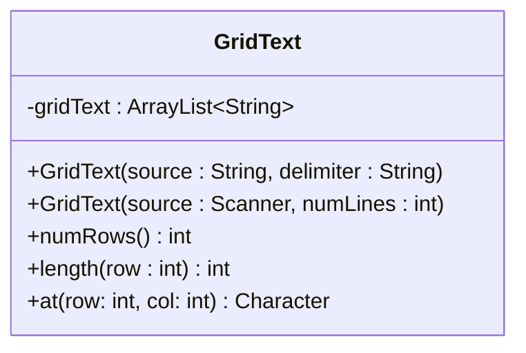
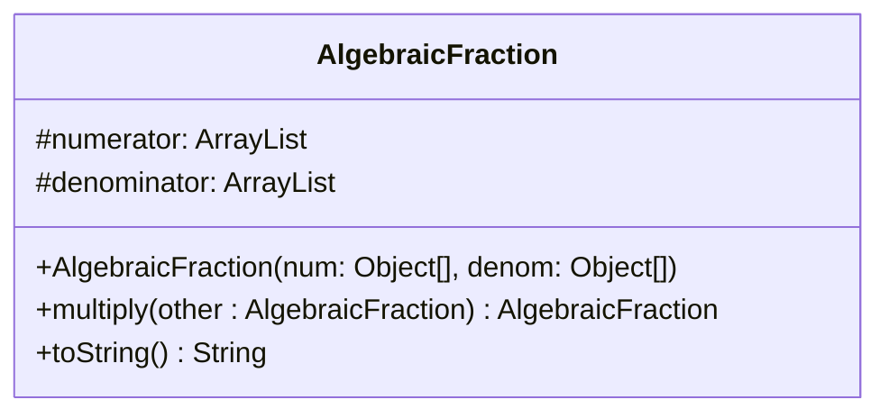

<!--
**Note**: This file was designed for GitHub Markdown for viewing at github.com. Please view it there. If you render it on Visual Studio code, then it may not render everything correctly, and could lead to confusion. Thank you!
-->

# CSC 240 Computer Science III
### Homework 1  Basic Objects

## Introduction

This Assignment is meant to help refresh your memory about building objects with Java. You'll be implementing 2 classes meant to be reusable for many purposes. The classes will be described in text and in UML. The two classes are called `GridText` and `AlgebraicFraction`. Before you begin, download the [SelfAssessmentCSC240-HW1](SelfAssessmentCSC240-HW1.xlsx) excel file and fill out the first sheet as a preliminary self assessment. The file has additional sheets to fill out before each submission.

## Goals

1. Creating a class from UML
2. Using an ArrayList of Strings to simulate a ragged 2D array of characters.
3. Using an ArrayList to hold lists of variables.
4. Understanding how ArrayLists can be used as the underlying data structure of a class.

### GridText

The purpose of `GridText` is to have a character by character grid representation of any text file that can be indexed like a two-dimensional array is indexed. This can be useful if you want to display the text in a graphical environment or if you wanted to keep track of a cursor that is over text in a text field in a graphical environment.

<!--
**Note**: The below diagram should not be viewed as raw text and may not render correctly in Visual Studio Code. Please view the assignment directions on the web at your github repository. (Or print the web version to a pdf and view that.) 
-->

#### Class description
`GridText` - an object for converting text a 2-D Character array.   

- fields
  - gridText: an `ArrayList<String>` that has one line/row of text at each index.
- methods
  - `GridText(source, delimiter)`: The source string should be `split` by the delimiter using the String `split` method and each string in the resulting array should be added to the `gridText` list in order.
  - `GridText(source, numLines)`: The source Scanner should be read one line at a time (a maximum of numLines times) using the `nextLine` method and each line should be added to the `gridText` list in order. If there are fewer than numLines in the source Scanner, then the resulting GridText should have the number of lines retrieved from the scanner as its number of rows. If there are more than numLines in the source Scanner, then the resulting GridText should have `numLines` rows in the arraylist.
  - `numRows()` : this method should return the number of strings in `gridText`.
  - `length(row)`: this method should return the number of characters in the row at the index specified by `row` 
  - `at(row,col)`: this method should return the character at `row`,`col` or `null` if either the row or the col are out of bounds. 

### Algebraic Fraction

The perpose of `AlgebraicFraction` is to have an Object based version of a fraction so that you could represent Objects with a fractional relationship. An example would be  $\frac{ab}{cd}$. An algebraic fraction should be reduced during it's construction, so if the numerator were $abc$ and the denominator was $cd$, then the c in the numerator and the c in the denominator would cancel, and the fraction would become $\frac{ab}{d}$.

<!-- **Note**: The below diagram should not be viewed as raw text and may not render correctly in Visual Studio Code. Please view the assignment directions on the web at your github repository. (Or print the web version to a pdf and view that.) 
-->

#### Class description

`AlgebraicFraction` - an object for holding abstract fractional representations. 

- fields
  - numerator: an `ArrayList` of each numerator component
  - denominator: an `ArrayList` of each denominator component
- methods
  - `AlgebraicFraction(num, denom)`: The values of each cell of the num array should be put in to the numerator ArrayList and the values of each cell in the denom array should be put into the denominator ArrayList. Then the fraction should be reduced with the below Fraction reducing algorithm.
  - `multiply(otherFraction)` should return a new AlgebraicFraction from the combination of the two fractions. See Fraction multiplication algorithm.
  - `toString()`: this method should return a String representation of the (reduced) fraction. The parts of the numerator should be prefixed by a "( " then separated by single spaces followed by  " ) / (" and then the parts of the denominator should be separated by spaces and then ended with a " )". 

***Fraction reducing algorithm***  
For each Object `n` in the num array (passed into the constructor):  

  - if `n` is in the numerator ArrayList and `n` is in the denominator ArrayList
      - remove `n` from the numerator array list
      - remove `n` from the denominatory array list

***Fraction multiplication algorithm*** 
 
1. to multiply fractions `a` and 	`b`
2. combine the numerators of fractions `a` and `b`
3. combine the denominators of fractions `a` and `b`
4. make a new fraction with the combined numerators and denominators
5. (reduce)

***Fraction multiplication example***

1. *(a b c) / (d e f) times (d f g) / (a e r)*
2. combined numerator: *(a b c d f g)*
3. combined denominator: *(d e f a e r)*
4. new fraction *(a b c d f g) / (d e f a e r)*
5. reduced: *(b c g) / (e e r)* 

## Requirements

1. the above classes `GridText` and `AlgebraicFraction` must have the specified fields and methods.
2. each file should have comments that include the author's name
3. all tests should pass
4. Write a short narrative of how much you learned by doing this assignment.
   - to assist with the narrative, use the [SelfAssessmentCSC240-HW1](SelfAssessmentCSC240-HW1.xlsx) excel file before starting, and for each submission. Your narrative should reflect on the below concepts as well as overall learning goals for the course.
        1. reading a UML diagram (1 don't understand - 5 completeley understand)
        2. writing a shell class (1 don't understand - 5 completeley understand)
        3. turning an algorithm into Java code (1 don't understand - 5 completeley understand)
        3. the `List` `contains` method (1 don't understand - 5 completeley understand)
        4. the `List` `remove` method (1 don't understand - 5 completeley understand)
        5. the `List` `toArray()` method (1 don't understand - 5 completeley understand)
        6. the `List` `get()` method (1 don't understand - 5 completeley understand)
        6. the `String` `charAt()` method (1 don't understand - 5 completeley understand)
        7. the `String` `length()` method (1 don't understand - 5 completeley understand)
        8. the difference between a *field* and a *parameter* (1 don't understand - 5 completeley understand)
        9. the purpose of a constructor (1 don't understand - 5 completeley understand)
        10. 2-D Array Indexing (1 don't understand - 5 completeley understand)
        11. Ragged vs Rectangular arrays (1 don't understand - 5 completeley understand)
   - when you finish the assignment rank your understanding of the above concepts again and compare the difference.

### Submission

When you submit your files to this repository they will be tested with the GitHub classroom autograding system. You can submit as many versions of each file until all of the tests pass.

The first tests will test the `GridText` using different constructors.  There are 4 tests. 

The second tests will test the`AlgebraicFraction` using different constructors and multipliers. There are 4 tests.

*The points for the autograder are just so that you know how many tests passed.* Passing the tests is just a way to see if your code works correctly. It does not directly address your learning of the material. Your narrative should include a discussion of the autograder results as well as any other tests you performed to make sure that your classes worked.

